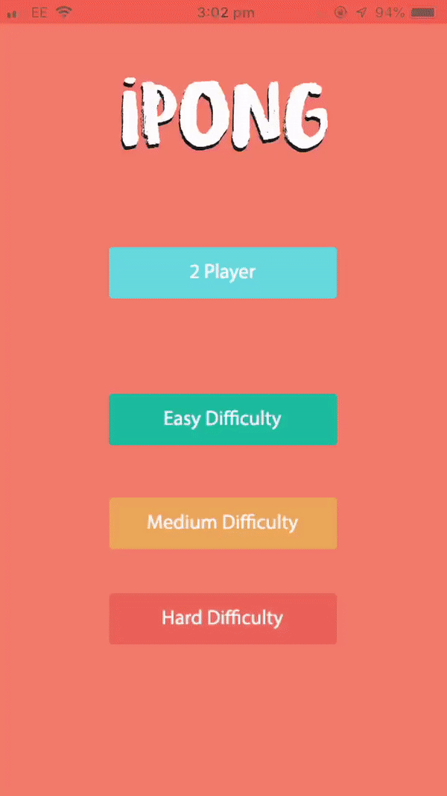

# IPong

This has been my summer project (2019) and main goal to get complete! It was made with sprite kit, Swift and designed to be as simple as possible!
# Difficulties 
The game includes various difficulties, easy, medium and hard and each difficulty is reflected on how the bot can react to the ball. This is done by a delay effect which means that its easier to score if the bot is slower (easy) and as you change the level, the delay effect gets reduced further.
# Outcome

